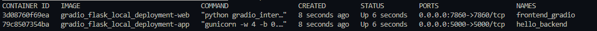
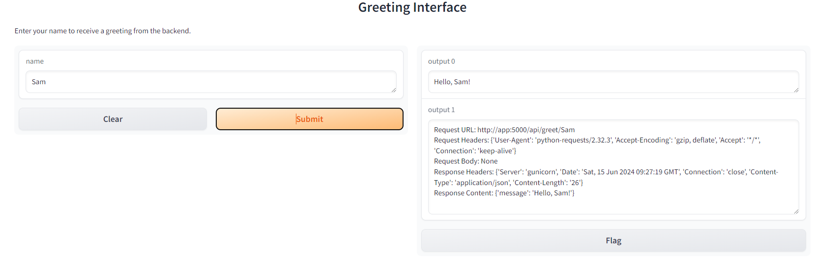

# Docker local deployment with Flask and Gradio

## Description

1. Quickly deploy backend and frontend apps locally. 
2. Understanding the use of docker compose to build microservices for the flask app and the frontend web service. 
3. Learn to use REST API to .get() from Flask in json and print out request details 

## Getting Started

### Dependencies

List down any dependencies that your project might have. For example:

- flask 
- gunicorn 
- flask-cors
- gradio 

### Installing

Assuming already cloned, can simply docker compose up and build. 

To access frontend please go to `localhost:7860`. Request.get() will reach out to port 5000.  

# Docker compose build 
docker-compose up -d --build 
```

### Docker containers



### Frontend



## API Request and Response Details

### Code line request 

```python
def get_greeting(name):
    """Function to call the Flask API and get a greeting."""
    url = f'http://app:5000/api/greet/{name}'
    response = requests.get(url)
    
    request_details = (
        f"Request URL: {response.request.url}\n"
        f"Request Headers: {response.request.headers}\n"
        f"Request Body: {response.request.body}\n"
    )
    
    if response.status_code == 200:
        response_details = (
            f"Response Headers: {response.headers}\n"
            f"Response Content: {response.json()}\n"
        )
        greeting = response.json()['message']
    else:
        response_details = f"Error Response: {response.text}\n"
        greeting = 'Error contacting backend'
    
    details = request_details + response_details
    return greeting, details
```


### Request

**URL:** `http://app:5000/api/greet/sdsd`

- `http://app:5000` is the base URL, where `app` is the name of the Docker service for your Flask backend.
- `/api/greet/sdsd` is the endpoint being accessed, with `sdsd` being the name parameter sent to the backend.

**Headers:**

- `User-Agent`: Identifies the client making the request. Here, it's `python-requests/2.32.3`, indicating that the Python requests library version 2.32.3 is being used.
- `Accept-Encoding`: Specifies the encoding algorithms the client can handle, such as gzip or deflate. This is used to compress the response data.
- `Accept`: Specifies the media types that are acceptable for the response. `*/*` means any type is acceptable.
- `Connection`: `keep-alive` means the connection should be kept open for further requests/responses, rather than being closed after this transaction.

**Body:** None (typical for a GET request)

### Response

**Headers:**

- `Server`: Indicates the software used by the server to handle the request. Here, `gunicorn` is used, which is a Python WSGI HTTP server for UNIX.
- `Date`: The date and time when the server responded to the request, formatted in GMT.
- `Connection`: `close` means the server will close the connection after delivering the response. This is often used in conjunction with HTTP/1.1 to manage persistent connections.
- `Content-Type`: The media type of the response content, which is `application/json` indicating the response body contains JSON data.
- `Content-Length`: The length of the response body in bytes. Here, it is 27 bytes.

**Content:** `{'message': 'Hello, sdsd!'}`

This is the actual body of the response, which in this case is a JSON object. The JSON object contains a single key-value pair: `"message": "Hello, sdsd!"`. This indicates that the backend processed the request and generated a greeting message for the name `sdsd`.