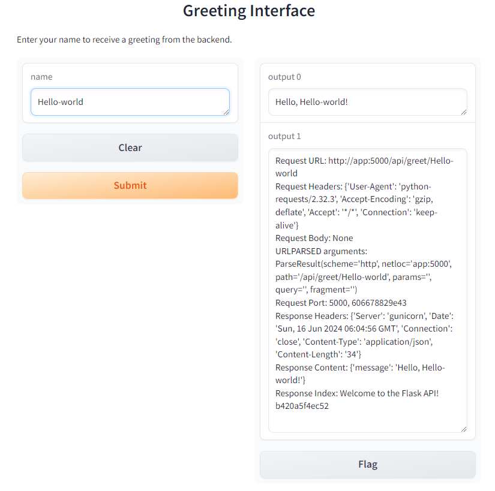
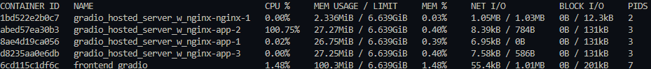

# Docker local deployment with Flask and Gradio with NGINX on server

## Description

This repository contains a setup for running a Flask backend and a Gradio frontend using Docker Compose, with Nginx as a reverse proxy. The Flask application provides a simple API endpoint, while the Gradio frontend offers an interface for interacting with the backend.


1. Quickly deploy backend and frontend apps on server using NGINX. 
2. Using NGINX to reverse proxy backend and also frontend not exposing any ports for both. 
3. Can just link IP address of VM, and set default url / to Gradio frontend and request.get will refer to app:5000 
4. Observer the different backend services activated and consume CPU resources. 

## Directory 

```
├── backend
│   ├── Dockerfile
│   ├── app.py
├── frontend
│   ├── Dockerfile
│   ├── gradio_app.py
├── nginx.conf
├── docker-compose.yml
└── README.md
```


## Getting Started

### Dependencies

List down any dependencies that your project might have. For example:

- flask 
- gunicorn 
- gradio 

### Installing

Assuming already cloned, can simply docker compose up and build. 

To access frontend please go to `<SERVER/VM PORT NUMBER>`.

# Docker compose build 

```bash
docker-compose up -d --build --scale app:3
```
> -d for detechd, --build to rebuild image with updates, --scale scale up app to 3 times. 

# Useful commands 
```bash
docker stats 
```

# Frontend



##  Docker stats indicating which backend container running 




## API Request and Response Details

### Code line request 

```python
def call_index():
    response = requests.get('http://app:5000/')
    if response.status_code == 200:
        return response.json()['message']
    else:
        return "Error: Unable to reach the API."
    
    
def get_greeting(name):
    """Function to call the Flask API and get a greeting."""
    url = f'http://app:5000/api/greet/{name}'
    response = requests.get(url)
    
    parsed_url = urlparse(response.request.url)
    port = parsed_url.port
    
    request_details = (
        f"Request URL: {response.request.url}\n"
        f"Request Headers: {response.request.headers}\n"
        f"Request Body: {response.request.body}\n"
        f"URLPARSED arguments: {parsed_url}\n"
        f"Request Port: {port}\n"
        f"Gradio host name: {socket.gethostname()}/n"
        f"\n"
    )
    
    if response.status_code == 200:
        response_details = (
            f"Response Headers: {response.headers}\n"
            f"Response Content: {response.json()}\n"
            f"Response Index: {call_index()}\n"
            f"\n"
        )
        greeting = response.json()['message']
    else:
        response_details = f"Error Response: {response.text}\n"
        greeting = 'Error contacting backend'
    
    details = request_details + response_details
    return greeting, details
```

# NGINX SETUP 

## Setup ngix.conf
```
events { }

http {
    upstream app {
        server app:5000;
    }

    server {
        listen 80;

        location /api/greet/ {
            proxy_pass http://app;
            proxy_set_header Host $host;
            proxy_set_header X-Real-IP $remote_addr;
            proxy_set_header X-Forwarded-For $proxy_add_x_forwarded_for;
            proxy_set_header X-Forwarded-Proto $scheme;
        }

        location / {
            proxy_pass http://web:7860;  # Forward requests to the Gradio frontend
            proxy_set_header Host $host;
            proxy_set_header X-Real-IP $remote_addr;
            proxy_set_header X-Forwarded-For $proxy_add_x_forwarded_for;
            proxy_set_header X-Forwarded-Proto $scheme;
        }
    }
}

```


## Nginx Configuration Explanation

### Events

The `events` block is required by Nginx configuration but does not contain specific settings in this case.

### HTTP

The `http` block contains configurations for handling HTTP traffic.

### Upstream App

Defines a group of backend servers. In this case, it points to the `app` service running on port 5000.

```nginx
upstream app {
    server app:5000;
}

### Server

Defines an Nginx server listening on port 80.

server {
    listen 80;
    ...
}

Location /api/greet/

Routes requests matching /api/greet/ to the app service. The proxy_pass directive forwards the request to the app service. The proxy_set_header directives pass necessary headers to the backend service.

location /api/greet/ {
    proxy_pass http://app;
    proxy_set_header Host $host;
    proxy_set_header X-Real-IP $remote_addr;
    proxy_set_header X-Forwarded-For $proxy_add_x_forwarded_for;
}

```

# Conclusion

By following the instructions in this README, we should be able to set up and run your Flask backend and Gradio frontend applications using Docker Compose and Nginx as a reverse proxy. This setup allows us to scale your backend services and provide a user-friendly frontend interface for interacting with your API.

